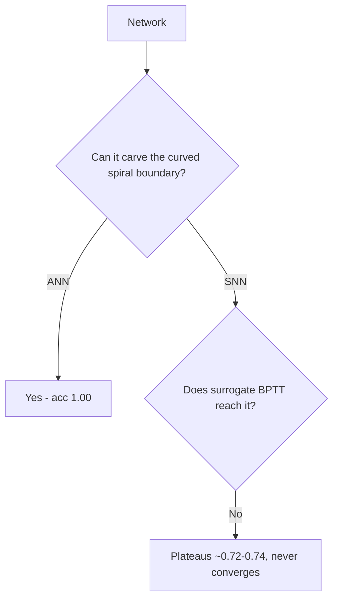

# Experiment 4 - Two-spiral classification (ANN vs SNN)

## Question

Can a spiking net be trained to classify two interleaved spirals (a hard curved boundary) as well as an ANN, and what does the energy cost?

## Setup

- Dataset: two-spiral, two interleaved arms, inputs normalized to [-1,1].
- ANN: input 2 -> hidden 64 (tanh) -> output 1 (sigmoid). Trained with momentum (lr=3.0, momentum=0.9).
- SNN: LIF, hidden 64, T=8 timesteps. Activations compared: arctan, fast-sigmoid.
- Compare each against the correct answer. Metrics: accuracy, energy, speed.

## Mechanism

Same LIF + smooth-activation backprop-through-time as Experiment 3, but a two-coordinate input is encoded as spike rates and the hidden layer is much larger (64).

## How the metrics are calculated

- Accuracy: `(pred > 0.5) == truth` averaged.
- Energy:
  - ANN (MACs) = `(64*2 + 1*64) * samples`  (paid every forward pass).
  - SNN (synaptic ops) = number of spikes x synapses they cross, summed over timesteps.
- Speed: epochs to converge (first epoch with loss below 0.01, or best after the run); latency = timesteps (ANN 1, SNN 8).

## Decision tree

## Verified numbers

| Model | Accuracy | Energy | Epochs | Latency |
|:--|:--|:--|:--|:--|
| ANN | 1.00 | 57,600 | 2,276 | 1 |
| arctan | 0.72 | 177,465 | 12,000 | 8 |
| fast-sigmoid | 0.74 | 173,159 | 12,000 | 8 |

## Takeaway

The ANN solves the spiral perfectly; the spiking net plateaus around 0.72-0.74 and never converges, even after 12,000 epochs, and it uses about 3x the energy. On this curved, dense task the spiking net is neither as accurate nor as efficient. This is a trainability limit, not a capacity limit - the net can represent the boundary, but surrogate backprop-through-time cannot reach it.

## Implementation notes (what didn't work first)

- **ANN got stuck near 0.5.** Full-batch gradient descent with a small learning rate hit a bad saddle on the spiral. Fix: much larger learning rate (3.0) plus momentum (0.9) -> it escaped and reached 1.00. Lesson: the spiral is optimization-hostile; plain small-step GD is not enough.
- **Too slow to iterate** (~6 min/run). Fix: vectorize the training across the batch. Lesson: vectorize before tuning.
- **Accuracy bug**: `(N,1) == (N,)` broadcast to an `(N,N)` matrix, so accuracy looked wrong. Fix: reshape consistently. Lesson: check array shapes at the comparison.
- **The SNN would not converge.** Best accuracy ~0.72-0.74 with either arctan or fast-sigmoid, even after 12,000 epochs and learning-rate sweeps. The surrogate BPTT through a 64-neuron LIF over 8 timesteps did not reach the spiral boundary. This is an honest limit, not a bug.
- **Loss curves were too jumpy** for a spike-rate readout; smoothed them for readability.
