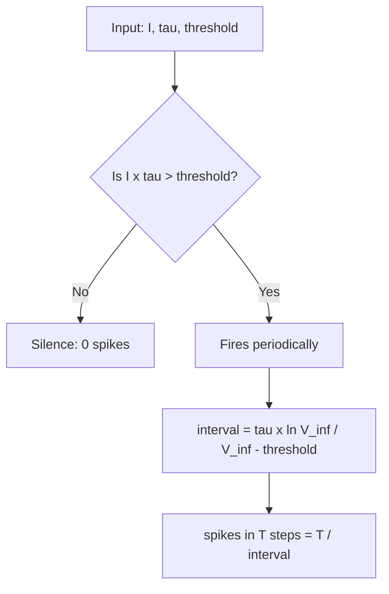

# Experiment 1 - Single LIF neuron

## Notation

| Symbol | Meaning | Run value |
|:--|:--|:--|
| `I` | injected current | 0.08 |
| `tau` | membrane time constant | 20 |
| `threshold` | voltage that triggers a spike | 1.0 |
| `V` | membrane voltage | state |
| `V_inf` | equilibrium voltage ceiling = `I * tau` | 1.6 |
| `T` | total time | 1000 |

## Mechanism (one update step)

```
tau * dV/dt = -V + I     then: if V >= threshold: fire and reset V to 0
```

- Leak (`-V`) pulls voltage toward 0.
- Input (`+I`) pushes voltage up.
- Fire the instant `V` reaches `threshold`, then reset.

## Key formulas

```
fires if   I * tau > threshold       (else silent)
V_inf      = I * tau
interval   = tau * ln( V_inf / (V_inf - threshold) )
spikes     = T / interval
```

## Relationships

| Change | Effect |
|:--|:--|
| `I` up | `V_inf` up, interval down, spikes up (nonlinear) |
| `I` below `threshold/tau` | silent (voltage never reaches threshold) |
| `tau` up | `V_inf` up, interval up, spikes down |

## Decision tree



## Verified numbers

| `I` | `V_inf` | spikes (T=1000) | interval |
|:--|:--|:--|:--|
| 0.04 | 0.80 | 0 | never fires |
| 0.08 | 1.60 | 50 | 20.0 |
| 0.16 | 3.20 | 125 | 8.0 |

## Takeaway

Input strength sets firing rate: below the firing condition it is silent, above it the rate rises nonlinearly.
