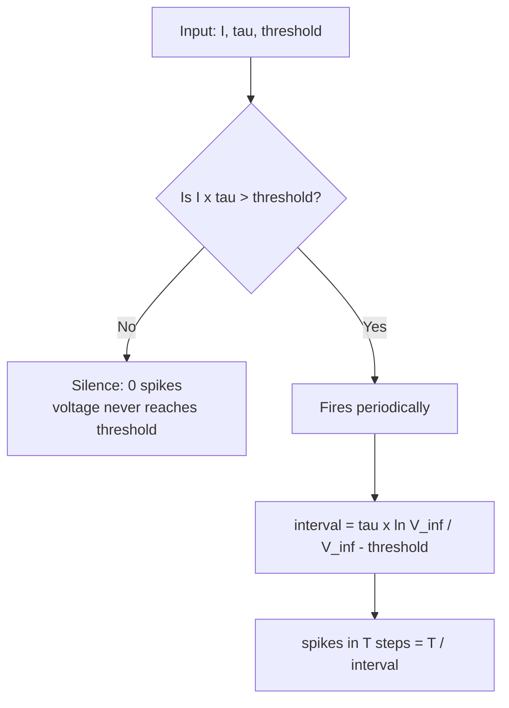

# Experiment 1 - Single LIF neuron: notes

What we learned, the notation, the formulas, and the relationships between them.

## Notation

| Symbol | Meaning | Units in our run |
|:--|:--|:--|
| `I` | injected input current (kept constant) | dimensionless |
| `tau` (τ) | membrane time constant; how fast the voltage reacts | time steps |
| `threshold` | voltage level that triggers a spike | voltage |
| `V` | membrane voltage (internal state) | voltage |
| `V_inf` | equilibrium ceiling the voltage settles toward | voltage |
| `T` | total simulated time | time steps |

## The mechanism (one equation)

The leaky integrate-and-fire (LIF) neuron updates its voltage each step:

```
tau * dV/dt = -V + I        then: if V >= threshold: fire a spike, reset V to 0
```

- `-V` is the leak: it pulls the voltage back toward 0.
- `+I` is the input: it pushes the voltage up.
- The neuron fires the instant `V` reaches `threshold`, then resets.

## The two key formulas

**1. The voltage ceiling** (what the leak allows on a steady current):

```
V_inf = I * tau
```

**2. The spike interval** (time between two spikes):

```
interval = tau * ln( V_inf / (V_inf - threshold) )
```

Over `T` steps, the spike count is then:

```
spikes = T / interval
```

## The decision tree



## The relationships (what changes what)

| Change | Effect on V_inf | Effect on interval | Effect on spike count |
|:--|:--|:--|:--|
| increase `I` | increases | shrinks | increases (nonlinear) |
| decrease `I` below `threshold/tau` | below threshold | never fires | drops to 0 (silence) |
| increase `tau` (leakier) | increases | lengthens | decreases |

**The one rule to remember:** a neuron fires only if `I * tau > threshold`. Below that, it is silent. Above it, more current means a shorter interval and more spikes, and the relationship is nonlinear (driven by the logarithmic interval formula).

## Verified with our runs

| `I` | `V_inf` | spikes (T=1000) | mean interval |
|:--|:--|:--|:--|
| 0.04 | 0.80 | 0 | never fires |
| 0.08 | 1.60 | 50 | 20.0 |
| 0.16 | 3.20 | 125 | 8.0 |

## Core takeaway

For a single LIF neuron, **input strength sets the firing rate**: below the threshold-to-ceiling condition it is silent, and above it the firing rate rises with current in a nonlinear, predictable way.
