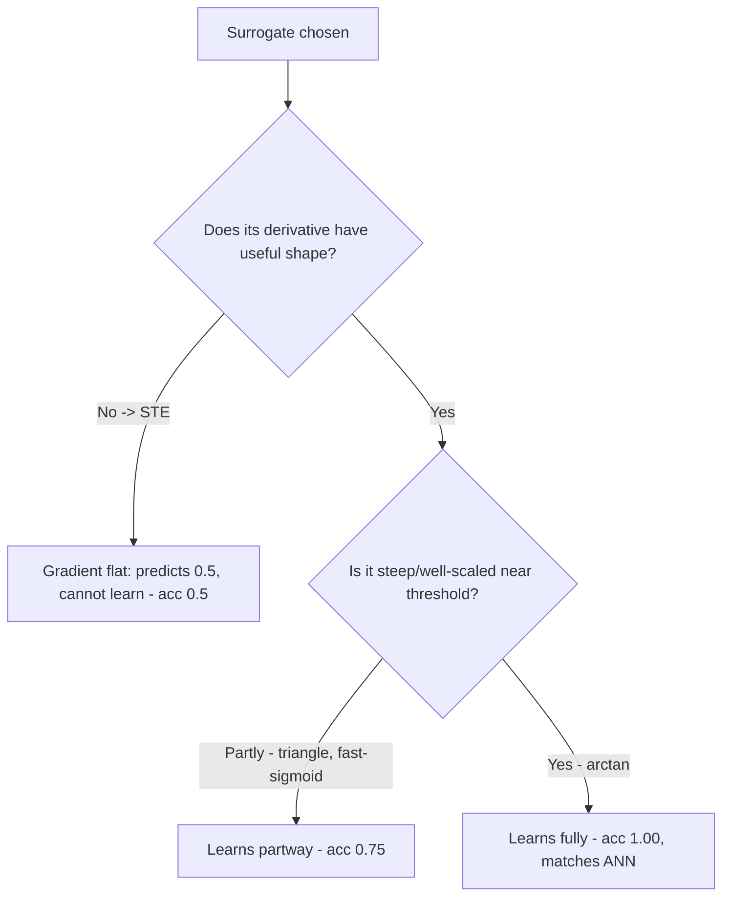

# Experiment 3 - Spiking vs standard network on XOR

## Question

Can a spiking network be trained to solve a task a standard network can, and do different surrogate gradient functions change how well it trains?

## Setup

- Task: XOR (output 1 if the two inputs differ). Not linearly separable, so it needs a hidden layer.
- Networks: a plain ANN (hidden 4) and a LIF spiking net (hidden 4, T=8 timesteps), each compared against the correct answer.
- Surrogates: STE, triangle, fast-sigmoid, arctan.

## Mechanism

The spike is a step function (0/1), so its derivative is undefined. Training uses a surrogate gradient: keep the real spike in the forward pass, but substitute a smooth function for the derivative in the backward pass. The shape of that function decides how the gradient flows.

## The surrogate functions

| Name | Forward spike | Backward derivative (approximation) |
|:--|:--|:--|
| STE | step | 1 (constant) |
| triangle | step | `1 - abs(V - threshold)` clipped to 0..1 |
| fast-sigmoid | step | `1 / (1 + 5*abs(V - threshold))^2` |
| arctan | step | `5 / (2*(1 + (a*(V - threshold))^2))`, `a = pi*5/2` |

## How the metrics are calculated

### Accuracy
Correct predictions / total. A prediction > 0.5 counts as 1, else 0, compared to the truth.

```
acc = ( (pred > 0.5) == truth ).mean()
```

Worked example: arctan predictions `[0.01, 0.99, 0.99, 0.01]` vs truth `[0, 1, 1, 0]` -> all four match -> acc = 1.00.

### Energy
- ANN: count of multiply-accumulate (MAC) operations, paid once per forward pass.

```
ann_MACs = (hidden_units*inputs + output_units*hidden_units) * samples
         = (4*2 + 1*4) * 4 = 48
```

- SNN: synaptic operations (SOPs). Each spike triggers one weight-accumulate on each postsynaptic neuron it connects to.

```
sop = sum over samples of ( input_spikes*4 + hidden_spikes*1 ) * T
```

Worked example: a busy net fires many spikes, so its SOP count is high, e.g. arctan = 384 because it spikes heavily once learned.

### Speed / latency
- Training speed: the epoch (pass) where loss first drops below 0.01.
- Inference latency: the number of timesteps the net needs. ANN = 1, SNN = T = 8.

## Decision tree



## Verified numbers

| Model | Accuracy | Energy (ops) | Epochs | Latency |
|:--|:--|:--|:--|:--|
| ANN | 1.00 | 48 | 895 | 1 |
| STE | 0.50 | 128 | 1500 | 8 |
| triangle | 0.75 | 256 | 1500 | 8 |
| fast-sigmoid | 0.75 | 176 | 1500 | 8 |
| arctan | 1.00 | 384 | 1083 | 8 |

## Takeaway

The surrogate gradient's shape decides whether a spiking net learns at all: arctan matches the ANN, STE cannot. And on a dense binary task the spiking net uses *more* energy, not less - the energy advantage only appears for sparse, event-driven input.
