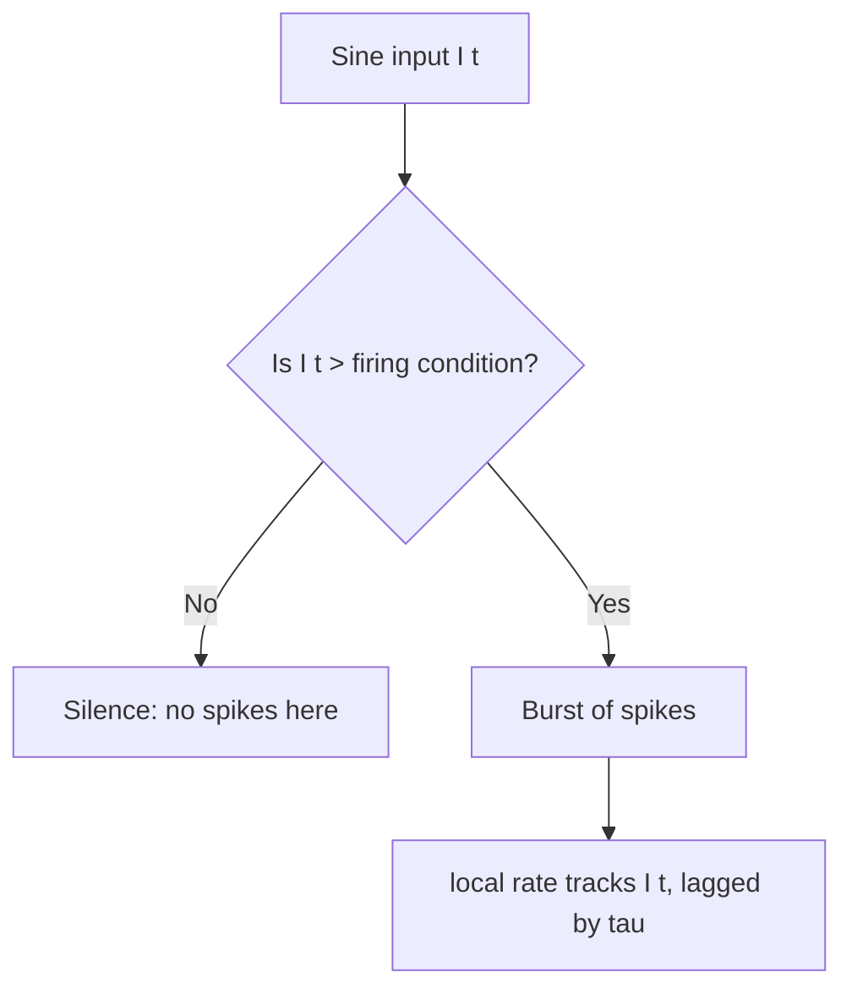

# Experiment 2 - Encoding a changing input (rate coding)

## Notation

| Symbol | Meaning | Run value |
|:--|:--|:--|
| `I(t)` | time-varying input current | sine |
| `mean` | mean of the input | 0.07 |
| `amp` | amplitude of the input | 0.05 |
| `period` | sine period | 250 steps |
| `firing_condition` | current that allows firing = `threshold/tau` | 0.05 |
| `tau`, `threshold`, `reset`, `T` | as in Experiment 1 | 20 / 1.0 / 0 / 1000 |

## Mechanism

Same LIF update, but the current is now a function of time:

```
tau * dV/dt = -V + I(t)      then: if V >= threshold: fire and reset V to 0
```

The firing condition is now local in time: a spike can only happen where `I(t) > threshold/tau`.

## Key relationships

| Change | Effect |
|:--|:--|
| `I(t)` above firing condition | fires locally (burst) |
| `I(t)` below firing condition | silence |
| rate follows | tracks `I(t)`, delayed by ~`tau` |

## Decision tree



## Verified numbers

- Spikes: 39 in 1000 steps.
- Bursts near the input peaks (approx every 250 steps), silence near the troughs.
- Rate follows the input with a lag of roughly `tau = 20` steps.

## Takeaway

A single neuron encodes a changing input as a changing spike rate: denser where the input is strong, silent below the firing condition, and lagged by the membrane time constant.
