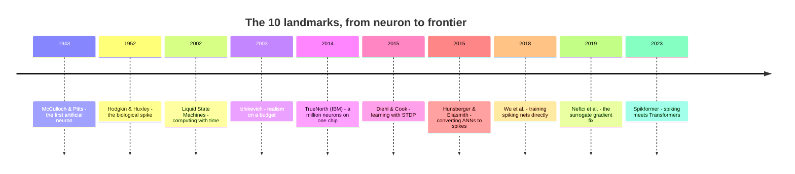

# Spiking Neural Networks: A Field Guide

**What they are, the 10 papers that built the field, and where things are heading.**

Spiking Neural Networks (SNNs) are the "brain-like" branch of AI. Instead of passing around continuous numbers like a normal neural network, SNNs communicate with **discrete events called spikes** that happen over time.

---

## The one idea that makes SNNs different

In a standard ANN, a neuron outputs a float like `0.83`. In a spiking network, a neuron **integrates** incoming signals into a *membrane potential*. When that potential crosses a threshold, the neuron fires a single spike, then resets.

- **Time is first-class.** Spikes happen at moments in time, not in discrete fixed layers.
- **The energy bargain comes from sparsity.** A neuron only spends energy when it actually fires. Idle neurons cost almost nothing.
- **It's closer to how real brains work.** Information is carried by *when* spikes arrive, not just how strong a signal is.

Think of it this way: a conventional network is a **turn-based board game** - everyone moves in rounds. An SNN is a **real-time conversation** - neurons react the instant something happens.

> The whole field is a tug-of-war between two questions: *how biological should we be?* and *how well can it actually learn?*

---

## The 10 papers that map the whole spectrum

### 1. McCulloch & Pitts - *A Logical Calculus of the Ideas Immanent in Nervous Activity* (1943)

The very first mathematical neuron. A **threshold gate**: if enough inputs fire, it fires.

- **The insight:** you can formalize a neuron as a simple logical unit. Neurons aren't mystical - they can be computed on.
- **Why it matters:** this is the birth of both neural networks *and* the idea that the brain is, in principle, computable. Everything here traces back to it.

### 2. Hodgkin & Huxley - *A Quantitative Description of Membrane Current...* (1952)

The ground-truth biological model. They described how an **action potential** (a spike) actually forms via voltage-gated ion channels in a squid axon. Nobel Prize, 1963.

- **The insight:** a spike is a *physical, time-dependent event*. This is where "spiking" gets its meaning.
- **Why it matters:** it's the gold standard for biological realism - but it's also expensive to simulate. The whole field has been trying to get *some* of this realism, cheaply, ever since.

### 3. Maass, Natschläger & Markram - *Real-Time Computing Without Stable States* (2002)

Introduced the **Liquid State Machine (LSM)**. A fixed, randomly-connected pool of spiking neurons ("the liquid") turns a time-varying input into a high-dimensional state, and only a simple readout is trained.

- **The insight:** you don't have to train the whole network. A mostly-random recurrent "reservoir" can do heavy lifting for you.
- **Why it matters:** you can compute with *time* - and you don't need supervised gradients through everything. It also planted the seed of reservoir computing and showed the power of recurrent temporal dynamics.

### 4. Izhikevich - *Simple Model of Spiking Neurons* (2003)

Two ordinary differential equations and four parameters reproduce many real spiking/bursting patterns.

- **The insight:** realism and efficiency live on a spectrum. You can get most of the biology for a tiny fraction of the cost.
- **Why it matters:** this "efficient-but-expressive" model became the workhorse for large-scale simulation, and it's the philosophical midpoint between the huge Hodgkin-Huxley model and a bare integrate-and-fire neuron.

### 5. Diehl & Cook - *Unsupervised Learning of Digit Recognition Using Spike-Timing-Dependent Plasticity* (2015)

Trained a two-layer network on MNIST using **STDP** - a biologically plausible local rule where a synapse strengthens if the pre-synaptic neuron fires just before the post-synaptic one. ~95% accuracy, no labels.

- **The insight:** a **local, spike-based learning rule** can genuinely learn a real task. You don't need backpropagation for everything.
- **Why it matters:** it proved biologically-inspired learning actually works - but accuracy still lagged behind deep ANNs. The gap became the field's central motivation.

### 6. Hunsberger & Eliasmith - *Spiking Deep Networks with LIF Neurons* (2015)

Took already-trained ANNs and **converted** them into spiking networks, using leaky integrate-and-fire neurons and a "softened" activation so gradients stay bounded.

- **The insight:** you can *reuse* deep learning's advances - train a normal network, then translate it into spikes.
- **Why it matters:** it closed the gap enough to make deep spiking networks competitive, and it established the **ANN-to-SNN conversion** route. But the conversion loses some fidelity, and running the converted network is still costly.

### 7. Wu, Deng, Li, Zhu & Shi - *Direct Training for Spiking Neural Networks: Faster, Larger, Better* (2018)

Introduced **Spatio-Temporal Backpropagation (STBP)** and a Neuron Normalization scheme, letting deep spiking nets be trained *directly* in PyTorch, not just converted.

- **The insight:** you *can* backpropagate through spikes - if you treat time-step-to-time-step and layer-to-layer gradients together.
- **Why it matters:** it broke the false assumption that direct training was too hard, and pushed spiking nets past 90% on CIFAR-10 as a baseline others now build on.

### 8. Neftci, Mostafa & Zenke - *Surrogate Gradient Learning in Spiking Neural Networks* (2019)

The clean unifying fix. The problem: a spike is a step function - **not differentiable** - so backprop through it is undefined. The fix: use a **surrogate** (smooth) function during the backward pass and the real spike during the forward pass.

- **The insight:** you can keep the exact spike forward, and simply swap in a smooth "fake" derivative backward. It works. It's robust to the shape of the surrogate, mostly sensitive to its *scale*.
- **Why it matters:** this is *the* reason SNNs are trainable today. It made spiking networks a first-class member of deep learning - you can stack layers, use optimizers, and scale up.

### 9. Merolla et al. - *A Million Spiking Neurons Integrated in a Single Chip* (2014)

**TrueNorth (IBM).** A digital, non-von-Neumann chip with ~1 million neurons and 256 million synapses running at roughly **70-100 mW**.

- **The insight:** the spiking paradigm isn't just theory - it can be built in **silicon**, and it's astonishingly power-efficient.
- **Why it matters:** it proved the energy promise is real and kicked off the modern neuromorphic hardware race. Its limit (no native on-chip learning) became the next target.

### 10. Zhou et al. - *Spikformer: When Spiking Neural Network Meets Transformer* (2023)

Brought spiking computation to the architecture that rules AI. It introduces **Spiking Self-Attention (SSA)** and *removes softmax*, so the attention is computed with sparse, addition-heavy operations instead of multiplications.

- **The insight:** spiking neurons and Transformers can combine - and by dropping softmax you keep the whole thing spike-friendly.
- **Why it matters:** it's the current architectural frontier - an SNN that hits **~75% on ImageNet** while keeping the energy story, which previous spiking convolutional nets couldn't do.

---

## The story in one table

| Era | The question | The answer |
|:---|:---|:---|
| **1943-2003** - The neuron | What *is* a spike, and how much biology do we need? | A spike is a discrete, timed event; rich dynamics come cheap |
| **2014-2019** - Deep learning | How do we *train* these networks? | Convert from ANNs, or train directly with surrogate gradients |
| **2023-now** - Architecture & silicon | Can SNNs match modern ANNs and scale? | Spiking Transformers + more capable neuromorphic chips |

---

## Where the field is heading (2024-2025)

- **Spiking Transformers are going mainstream.** Beyond Spikformer, there's the **Spike-driven Transformer** line (V1 → V2 → V3) and models like **SpikingResformer** and **QKFormer**. The trend is scaling these up and pushing accuracy closer to standard Transformers.

- **Neuromorphic hardware keeps getting better.** Intel's **Loihi 2** (2021) adds programmable neuron models and supports the open-source **Lava** framework; **Hala Point** (2024) scales to ~1.15 billion neurons. IBM's **NorthPole** (2023) also showed big wins on efficiency. Loihi 2 has been measured at **~100× more efficient than a CPU and ~30× a GPU** for certain workloads.

- **SNNs are reaching beyond vision.** Spiking networks are now being tried on **language models**, offline reinforcement learning (**Decision SpikeFormer**), neural radiance fields (**SpiNeRF**), and robotics. Some work even maps **state-space LLMs** onto Loihi 2.

- **The efficiency story is being scrutinized.** People are starting to benchmark energy *rigorously* rather than quoting ideal numbers - the real promise is a **combination of hardware sparsity and low-precision compute**.

## The honest open problems

- **The accuracy gap.** SNNs are closing in on ANNs but still trail on hard benchmarks.
- **Training at scale.** Surrogate gradients helped, but large-scale training remains harder and memory-intensive than plain backprop.
- **Fair energy comparison.** Many "X× more efficient" claims assume ideal hardware. Standardized benchmarks are still maturing.
- **Software maturity.** Good open-source stacks exist - **SpikingJelly**, **snnTorch**, **Norse**, and Intel's **Lava** - but the ecosystem is younger than mainstream deep learning.

---

## The takeaway

SNNs went from "can a neuron be formalized?" (1943) to "how do we train them?" (2019) to "can we match modern AI *and* run it cheaply?" (2023+). The two big wins - **event-driven energy efficiency** and **temporal computing** - are real and now live in actual silicon. The remaining fight is closing the performance gap and making the energy story provable at scale.
